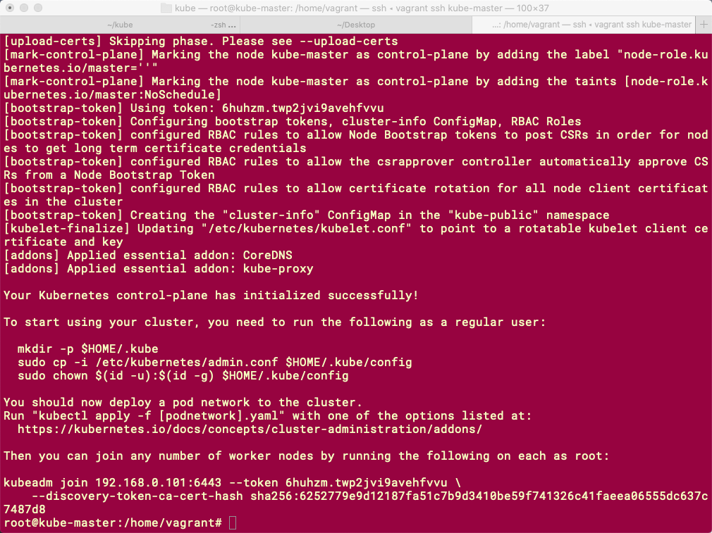
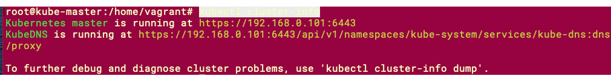

# Install Kubernetes cluster on Ubuntu
### Create Vagrant File
`vagrant init`
#### vagrant file with 1 master and 2 nodes
```ruby
# -*- mode: ruby -*-
# vi: set ft=ruby :


Vagrant.configure("2") do |config|
  # The most common configuration options are documented and commented below.
  # For a complete reference, please see the online documentation at
  # https://docs.vagrantup.com.

  # Every Vagrant development environment requires a box. You can search for
  # boxes at https://vagrantcloud.com/search.
  config.vm.box = "ubuntu/xenial64"

  config.vm.define "kube-master" do |kube_master|
    kube_master.vm.hostname = "kube-master"
    kube_master.vm.network "public_network", ip: "192.168.30.101"
    kube_master.vm.synced_folder ".", "/kube"
     config.vm.provider :virtualbox do |vb|
       vb.customize ["modifyvm", :id, "--memory", "1024"]
       vb.customize ["modifyvm", :id, "--cpus", "2"]
    end  
  end
  config.vm.define "kube-node1" do |node1|
    node1.vm.hostname = "kube-node1"
    node1.vm.network "public_network",  ip: "192.168.1.102"
     config.vm.provider :virtualbox do |vb|
       vb.customize ["modifyvm", :id, "--memory", "1024"]
       vb.customize ["modifyvm", :id, "--cpus", "2"]
    end  
  end
  config.vm.define "kube-node2" do |node2|
    node2.vm.hostname = "kube-node2"
    node2.vm.network "public_network", ip: "192.168.1.103"
     config.vm.provider :virtualbox do |vb|
       vb.customize ["modifyvm", :id, "--memory", "1024"]
       vb.customize ["modifyvm", :id, "--cpus", "2"]
    end  
  end

end

```
After changing file execute
```
vagrant up
```
do ssh vagrant 
```sh
vagrant ssh vagrant@kube-master
```
#### Update box
`sudo apt-get update`
#### Change user to sudo 
```shell 
sudo su
```
we need to turn off the swap on both node and master machines
```shell
swapoff -a
```
#### Create kubernetes repository

Kubernetes is not included in the default repositories. To add them, enter the following:
```
curl -s https://packages.cloud.google.com/apt/doc/apt-key.gpg | apt-key add -
```
```
cat <<EOF > /etc/apt/sources.list.d/kubernetes.list
deb http://apt.kubernetes.io/ kubernetes-xenial main
EOF
```
or 
```
sudo apt-add-repository "deb http://apt.kubernetes.io/ kubernetes-xenial main"
```
#### Installation of the packages
udpate the box
```
apt-get update -y
```
add all required packages 
```
apt-get install -y docker.io kubelet kubeadm kubectl kubernetes-cni
```
#### setup sysctl config 
```
sysctl net.bridge.bridge-nf-call-iptables=1
```
#### Setup of of Master 

```
kubeadm init --apiserver-advertise-address 192.168.30.101 --pod-network-cidr=192.168.0.0/16
```
 you will get following as output

 

 #### Configure kubectl
```
  mkdir -p $HOME/.kube
  sudo cp -i /etc/kubernetes/admin.conf $HOME/.kube/config
  sudo chown $(id -u):$(id -g) $HOME/.kube/config
  ```
#### Install CNI with Weavnet
```

export kubever=$(kubectl version | base64 | tr -d '\n')
kubectl apply -f "https://cloud.weave.works/k8s/net?k8s-version=$kubever"
```
  check if kubectl is configured correctly 
  ```
  kubectl cluster-info
  ```
  

  # Prepare Nodes
  `vagrant ssh kube-node1`
  #### Update box
`sudo apt-get update`
#### Change user to sudo 
```shell 
sudo su
```
we need to turn off the swap on both node and master machines
```shell
swapoff -a
```
#### Create kubernetes repository

Kubernetes is not included in the default repositories. To add them, enter the following:
```
curl -s https://packages.cloud.google.com/apt/doc/apt-key.gpg | apt-key add -
```
```
cat <<EOF > /etc/apt/sources.list.d/kubernetes.list
deb http://apt.kubernetes.io/ kubernetes-xenial main
EOF
```
or 
```
sudo apt-add-repository "deb http://apt.kubernetes.io/ kubernetes-xenial main"
```
#### Installation of the packages
udpate the box
```
apt-get update -y
```
add all required packages 
```
apt-get install -y docker.io kubelet kubeadm kubectl kubernetes-cni
```
#### setup sysctl config 
```
sysctl net.bridge.bridge-nf-call-iptables=1
```
#### Join Node 
```
kubeadm join --token 6huhzm.twp2jvi9avehfvvu -discovery-token-unsafe-skip-ca-verification 192.168.1.101:6443
```

### setup networking 
```
kubectl apply -f https://raw.githubusercontent.com/coreos/flannel/master/Documentation/kube-flannel.yml
```